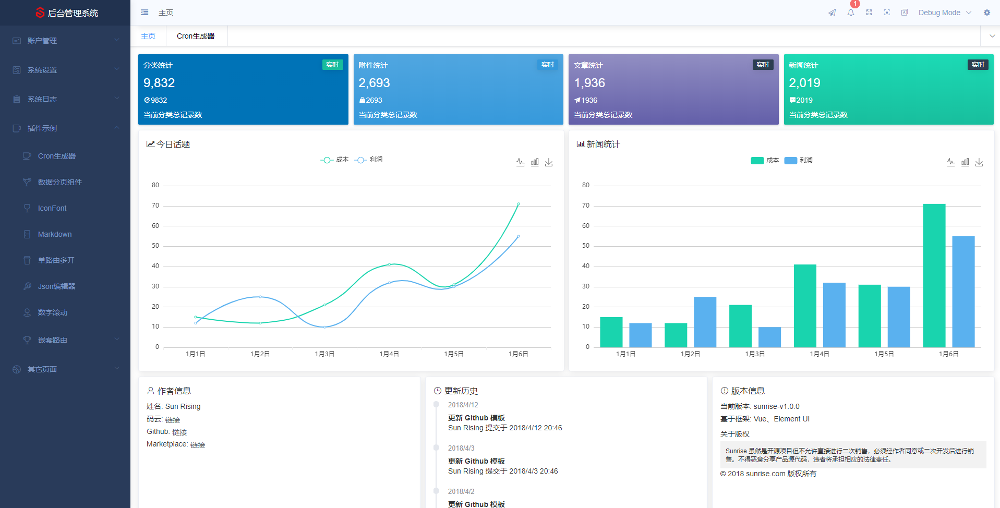

<h1 align="center">
  
</h1>

<h1 align="center">
  S U N R I S E
</h1>

<p align="center">
  <a href="https://github.com/vuejs/vue">
    
  </a>
  <a href="https://github.com/ElemeFE/element">
    
  </a>
  <a href="https://spring.io/projects/spring-boot/#learn">
    
  </a>
  <a href="LICENSE">
    
  </a>
</p>

简体中文

## 简介

_sunrise-electron-vue_ [[Gitee]](https://gitee.com/sunrise-chang/sunrise-electron-vue) [[GitHub]](https://github.com/SunRisingChang/sunrise-electron-vue) 是 _SUNRISE_ 系列项目的前端和 _sunrise-spring-boot_ [[Gitee]](https://gitee.com/sunrise-chang/sunrise-spring-boot) [[GitHub]](https://github.com/SunRisingChang/sunrise-spring-boot) 是姊妹项目，该项目是一个后台前端解决方案，它基于 [vue.js](https://github.com/vuejs/vue) 开发堆栈和 [electron](https://electronjs.org/) 并使用 [element-ui](https://github.com/ElemeFE/element) 实现。它使用了最新的前端技术栈，内置了 i18n 国际化解决方案，动态路由，权限验证，提炼了典型的业务模型，提供了丰富的功能组件，它可以帮助你快速搭建企业级中后台产品原型。相信不管你的需求是什么，本项目都能帮助到你。

## 在线预览

- [[Gitee]](https://sunrise-chang.gitee.io/sunrise-electron-vue)
- [[GitHub]](https://sunrisingchang.github.io)

## 活动圈

- QQ 技术交流群 [678251003]
- 邮箱[Sun_Rising_Chang@hotmail.com]

## 浏览器支持

| [](https://godban.github.io/browsers-support-badges/)</br>IE / Edge | [](https://godban.github.io/browsers-support-badges/)</br>Firefox | [](https://godban.github.io/browsers-support-badges/)</br>Chrome | [](https://godban.github.io/browsers-support-badges/)</br>Safari |
| ---------------------------------------------------------------------------------------------------------------------------------------------------------------------------------------------------------------- | ------------------------------------------------------------------------------------------------------------------------------------------------------------------------------------------------------------------ | -------------------------------------------------------------------------------------------------------------------------------------------------------------------------------------------------------------- | -------------------------------------------------------------------------------------------------------------------------------------------------------------------------------------------------------------- |
| IE10, IE11, Edge                                                                                                                                                                                                 | last 2 versions                                                                                                                                                                                                    | last 2 versions                                                                                                                                                                                                | last 2 versions                                                                                                                                                                                                |

## 前序准备

你需要在本地安装 [node](http://nodejs.org/) 和 [git](https://git-scm.com/)。本项目技术栈基于 [ES2015+](http://es6.ruanyifeng.com/)、[vue](https://cn.vuejs.org/index.html)、[vuex](https://vuex.vuejs.org/zh-cn/)、[vue-router](https://router.vuejs.org/zh-cn/) 、[vue-cli](https://github.com/vuejs/vue-cli) 、[axios](https://github.com/axios/axios) 和 [element-ui](https://github.com/ElemeFE/element) 等，所有的请求数据都使用 [Mock.js](https://github.com/nuysoft/Mock) 进行模拟，或使用 _sunrise-spring-boot_ [[Gitee]](https://gitee.com/sunrise-chang/sunrise-spring-boot) [[GitHub]](https://github.com/SunRisingChang/sunrise-spring-boot) 进行后端的快速搭建进行数据获取，提前了解和学习这些知识会对使用本项目有很大的帮助。

 <p align="center">
  
</p>

## 功能

```bash
- 登录 / 注销 / 锁屏 / 修改密码 / 修改个人信息

- 仪表盘面板

- 账户管理
  - 用户管理
  - 角色管理
  - 组织管理
  - 权限管理

- 系统设置
  - 菜单管理
  - 字典管理
  - 附件管理
  - 任务管理

- 系统日志
  - 交互日志
  - 任务日志

- 内置插件
  - Cron表达式选择器
  - 数据分页表格组件
  - Markdown 编辑组件
  - Json编辑器
  - 数字滚动
  - 记忆输入框
  - 可拖拽弹出层
  - 响应式栅格布局
  - 字典下拉
  - 文件上传
  - JSON编辑器
  - 页面缓存
  - 菜单显示
  - 模板表单

- 其它页面
  - 404
  - 500

- 多环境发布
  - 浏览器生产 桌面级生产

- 全局功能
  - 国际化多语言
  - 多种动态换肤
  - 侧边栏自适应收缩（支持三种响应级别）
  - 侧边栏多级路由嵌套
  - 侧边栏支持外链
  - 单路由页面多开
  - 动态面包屑
  - 快捷导航(标签页)
  - 标签页批量关闭
  - Echarts 图表
  - font-awesome 图标库
  - IconFont 图标库
  - 本地/后端 mock.js 数据
  - Screenfull全屏
  - 全局遮罩引导
  - 通知信息处理(后端长连接通知信息)
  - 前端异常捕获(会尝试调用后端日志记录接口)
  - 浏览器版本检测
  - 按钮级权限

- Electron
  - 自定义标题栏
  - 自动检查版本更新

```

## 开发

```bash
# 克隆项目
git clone https://gitee.com/sunrise-chang/electron-vue-sunrise.git

# 进入项目目录
cd electron-vue-sunrise

# 安装依赖
npm install

# 建议不要直接使用 cnpm 安装依赖，会有各种诡异的 bug。可以通过如下操作解决 npm 下载速度慢的问题
npm install --registry=https://registry.npm.taobao.org

# 启动浏览器开发服务或启动桌面开发服务
npm run serve
npm run electron:serve

```

## 发布

```bash
# 构建浏览器生产环境
npm run build

# 构建win桌面生产环境(精简打包)
npm run electron:build

# 构建win桌面生产环境(使用内置模板t1)
npm run electron:build:win:t1

# 构建win桌面生产环境(使用内置模板t2)
npm run electron:build:win:t2

# 构建linux桌面生产环境
npm run electron:build:linux

```

## 其它

```bash
# 输出webpack的配置文件
npm run inspect

# 代码格式检查
npm run lint

# 更新 iconfont 图标库
npm run update:icon

```

## 赞助商

成为赞助商并在 GitHub 上的 README 上获取您的徽标，并附上指向您网站的链接。

## 支持一下

如果你觉得这个项目帮助到了你，你可以帮作者买一杯果汁表示鼓励 :tropical_drink:

<h1 align="left">
  
</h1>

## License

[MIT](LICENSE)

Copyright (c) 2019-present SunRise
